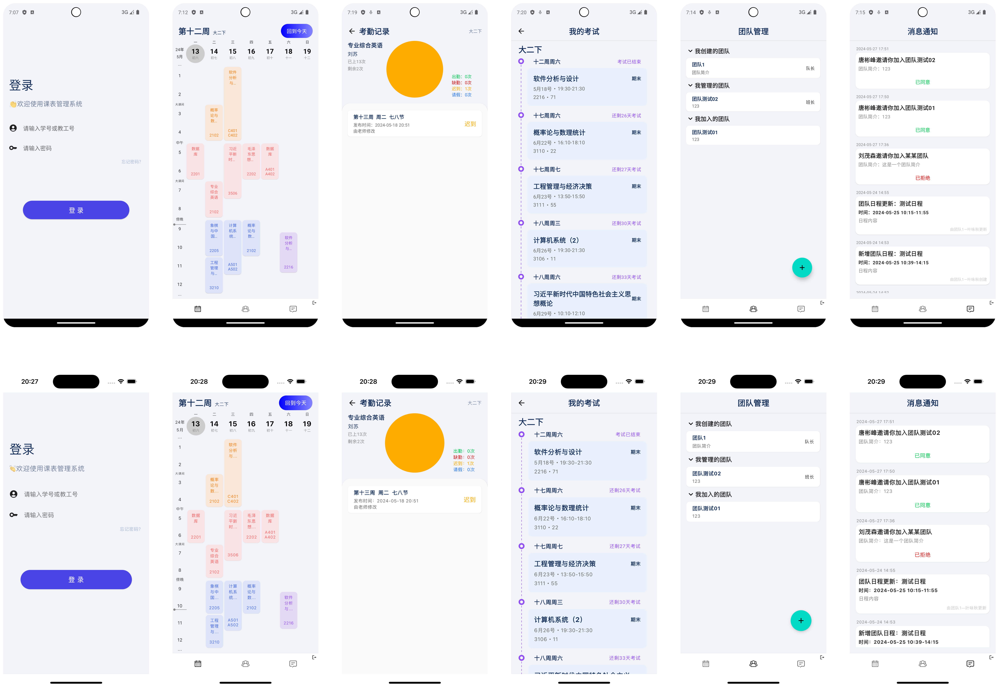

# CourseManagerSystem
 本科毕设—课表管理系统，纯 Kotlin 开发，使用 ComposeMultiplatform + SpringBoot，支持 Android、iOS、桌面端

## 功能
核心在于课表，除了会显示课程外，其他日程、考试都会在课表上显示
- 查看课表
- 安排日程
- 查看考试
- 班级管理
- 团队管理

部分界面截图如下（上面为 Android，下面为 iOS）：



## 构建
本项目最初的想法是支持构建出云端和本地版本，所以 [course-app/applications](course-app/applications) 下有 pro 和 local 两个模块，
分别对应云端和本地版本。对于网络请求也单独分离出了 [course-source](course-source) 模块。

### Local 版本

本地版本只包含课表、日程、考试、数据源功能，其中数据源支持设置 js 脚本爬取数据

<details>
<summary>打包教程折叠/展开</summary>

#### Android 打包
执行 `course-app.applications.local` 配置即可运行，打包跟普通的 Android 打包无区别

#### iOS 打包
> 前提：只能在 Mac 上才能打包

⚠️注意：目前 iOS 虽已支持打包运行，但是子模块的资源不会一同打包。
官方已修护该[问题](https://github.com/JetBrains/compose-multiplatform/pull/4454)，
但需要 kt2.0 版本，当前项目还在 dev-kt2 分支适配中

##### iOS 模拟器
AS 下载 `Kotlin Multiplatform Mobile` 插件，然后运行 `iosApp` 配置即可

若修改了模块依赖关系，则需要先执行以下命令设置 iOS 的打包配置
```shell
./gradlew :course-app:applications:local:setIOSProjectPbxproj
```

##### iOS 真机
因为本人无真机，所以无法调试，请看[官方教程](https://www.jetbrains.com/help/kotlin-multiplatform-dev/compose-multiplatform-create-first-app.html#run-on-a-real-ios-device)

#### 桌面端打包
执行 `desktopMain` 下 `main` 函数即可运行

打包需要对应设备执行以下命令
```shell
# 可以点击 idea 或 AS 右侧的大象图标里 Tasks/compose desktop 下同名任务
# debug 包
./gradlew packageDmg # Mac
./gradlew packageMsi # Win
./gradlew packageDeb # Linux

# release 包
./gradlew packageReleaseDmg # Mac
./gradlew packageReleaseMsi # Win
./gradlew packageReleaseDeb # Linux
```

</details>

### Pro 版本
pro 模块是云端版本，其构建过程与 Local 并无差异，但需要先运行后端服务 [course-server](course-server) 模块，
其中 [course-server/sql](course-server/sql) 包含了建表的 SQL 脚本。

### 第三方库
详细可看 [gradle/libs.versions.toml](gradle/libs.versions.toml)


> 由于本人能力有限，加上时间问题，所以某些代码写得比较乱